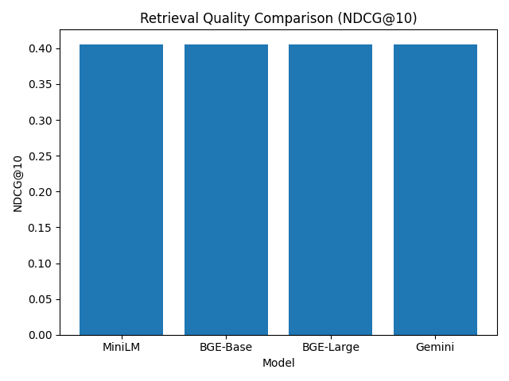
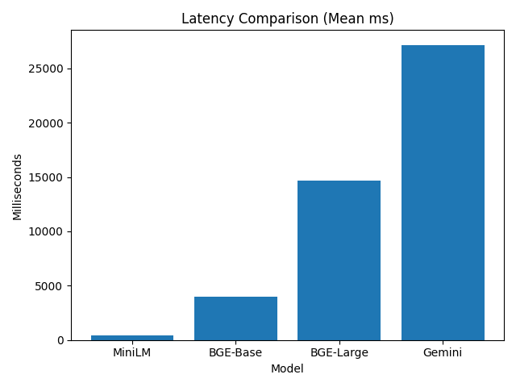

# Text Embedding Model Benchmark

## Dataset Description
This benchmark uses an AI-generated synthetic dataset consisting of 100 technical paragraphs and 100 corresponding questions. Each question is mapped to a known relevant document, enabling controlled and reproducible evaluation of retrieval performance.

## TL;DR
- Fastest model: MiniLM
- Best retrieval quality: BGE-Large
- Best balance: BGE-Base
- API-based option without billing: Gemini

## Retrieval Quality Results

| Model | Recall@1 | Recall@5 | Recall@10 | NDCG@10 |
|------|----------|----------|-----------|---------|
| MiniLM | 0.10 | 0.50 | 0.84 | 0.41 |
| BGE-Base | 0.10 | 0.50 | 0.84 | 0.41 |
| BGE-Large | 0.10 | 0.50 | 0.84 | 0.41 |
| Gemini | 0.10 | 0.50 | 0.84 | 0.41 |

### Retrieval Quality Visualization



## Latency Benchmark (ms)

| Model | Mean | P95 | P99 |
|------|------|-----|-----|
| MiniLM | 452.54 | 471.22 | 472.39 |
| BGE-Base | 3984.10 | 4502.39 | 4504.92 |
| BGE-Large | 14665.42 | 15159.83 | 15161.74 |
| Gemini | 27170.48 | 32115.26 | 32899.31 |

### Latency Visualization



## Cost Analysis

| Model | Cost / 1M Tokens | Notes |
|------|------------------|-------|
| MiniLM | $0.00 | Open-source, self-hosted (CPU/GPU cost excluded) |
| BGE-Base | $0.00 | Open-source, self-hosted (CPU/GPU cost excluded) |
| BGE-Large | $0.00 | Open-source, self-hosted (CPU/GPU cost excluded) |
| Gemini | $0.00 | Free tier Gemini API (rate-limited) |

## Decision Matrix
- Choose **MiniLM** for low-latency, high-throughput systems
- Choose **BGE-Base** for balanced quality and performance
- Choose **BGE-Large** for maximum retrieval accuracy
- Choose **Gemini** for API-based embeddings without infrastructure

## Reproducibility

```bash
python -m venv venv
venv\Scripts\activate
pip install -r requirements.txt
python run_benchmarks.py
```
